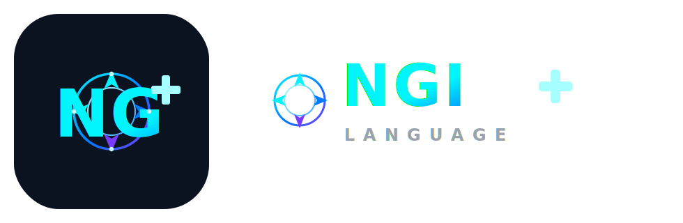

# NGI+

<p align="center">
  
</p>

NGI+ is a new programming language that combines the best features from multiple languages:

- **Speed like C++**: High performance with manual memory management options
- **Power like C# and Python**: Strong typing with dynamic options, rich standard library
- **Features from Java**: Platform independence, strong OOP
- **Features from JavaScript**: First-class functions, closures
- **JSON integration**: Native support for JSON data structures

## Features

- Hybrid typing: Static and dynamic typing modes
- Multiple paradigms: OOP, functional, procedural
- Native JSON support
- Cross-platform compilation
- Modern syntax inspired by Python and JavaScript

## Development Progress

### Week 1: Core Language Foundation
- ✅ Lexer and parser for basic syntax
- ✅ Control structures (if/else, while, for loops)
- ✅ Variables and assignments
- ✅ Basic expressions and operators
- ✅ Function definitions and calls

### Week 2: Advanced Features
- ✅ Typed function parameters
- ✅ Class definitions
- ✅ Enhanced VM with function/class storage
- ✅ Parameter binding in function calls
- ✅ Type system (int, float, string, bool)

### Week 3: Object-Oriented Programming (Completed)
- ✅ Class instantiation and object creation
- ✅ Methods for classes
- ✅ Return values from functions
- ✅ Enhanced type checking
- ✅ Memory management for objects

### Week 4: Android Development & Build Automation (COMPLETED)
- ✅ Advanced string processing with escape sequences
- ✅ Comments support (// and /* */)
- ✅ File I/O operations (read_file, write_file)
- ✅ Array operations and literals
- ✅ String manipulation functions (split, join, replace, to_upper, to_lower)
- ✅ Android build engine (CMakeLists.ngi)
- ✅ JSON configuration file support (project.ng)
- ✅ Cross-platform Android NDK build generation
- ✅ Complete Android app development workflow

### Week 5: Advanced Type System and Performance (IN PROGRESS)
- 🔄 Generic types and templates
- 🔄 Advanced collections (maps, sets)
- 🔄 Performance optimizations
- 🔄 Cross-platform compilation targets
- 🔄 Enhanced error handling
- 🔄 Module system
- 🔄 Standard library expansion
- 🔄 Advanced control structures
- 📋 **Cross-Platform Support**: Native compilation for Android, Windows, and Linux systems
- 📋 **Superior Project Building**: More powerful than traditional languages for building projects on these platforms
- 📋 **Advanced Tooling**: Integrated development tools optimized for multi-platform development

## Getting Started

1. Install Rust
2. Clone this repository
3. Run `cargo build` to build the compiler
4. Run `cargo run -- examples/hello_world.ng` to execute a program

## File Extension

NGI+ source files use the `.ng` extension.

## Language Syntax Examples

### Functions with Parameters

```ng
fn add(x: int, y: int) {
    print(x + y);
}

fn main() {
    add(5, 3);  // Prints: 8
}
```

### Class Definitions

```ng
class Person {
    let name: string;
    let age: int;
}
```

### Class Instantiation and Methods

```ng
class Person {
    let name: string;
    let age: int;

    fn greet() {
        print("Hello, my name is " + this.name);
        return;
    }
}

fn main() {
    let p = new Person();
    p.greet();
}
```

## Project Structure

- `src/`: Compiler source code
  - `lexer/`: Tokenization
  - `parser/`: Syntax analysis and AST
  - `runtime/`: Virtual machine execution
- `examples/`: Sample programs
- `tests/`: Unit tests
